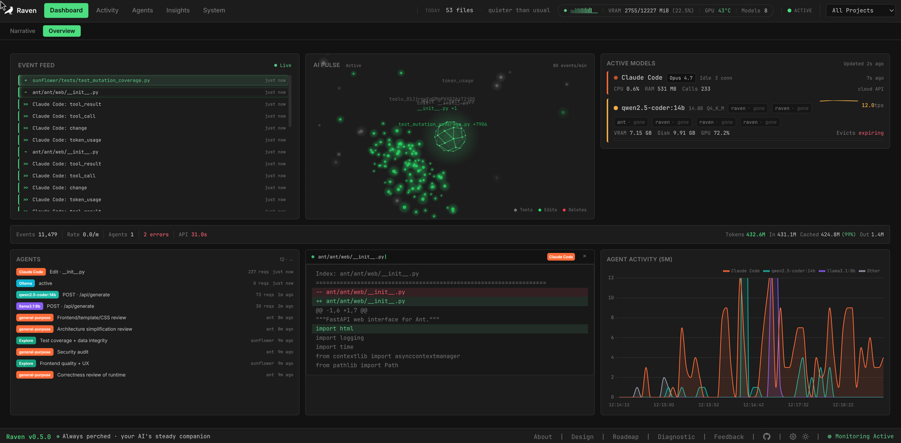

# Raven

> The flight recorder for everything AI does on your machine. Raven watches Claude Code, Codex, and local Ollama models work — every file they touch, risk-scored diffs, token burn, anomalies — and tells you what happened in plain English. Local-first: nothing leaves the host.



Cost trackers tell you what you spent. Session viewers show you a transcript. Raven answers the question neither of them can: **what did my AI agents actually do to my machine today, was any of it risky, and am I about to hit my plan limits?**

Pre-1.0 — public preview at **`0.6.0`**. The wiring is solid; rough edges are honest.

## What you get

- **File-level provenance** — every edit/create/delete an agent makes, recorded to SQLite with agent attribution, browsable and searchable across every project on the machine.
- **Diff risk scoring at ingest** — every diff is scanned as it happens (hardcoded credentials, token prefixes, `eval`, `--no-verify`, `.env` edits, PEM keys) with gutter pills and per-file severity badges. Historical diffs are backfilled on first run.
- **Plan-limit burn-down** — rolling 5-hour window usage vs your Pro/Max cap, burn rate, and a "you'll hit the cap at 3:40pm" projection. Budgets are community estimates, clearly labeled and overridable once you observe your real cap.
- **Live cost ticker** — token spend ticking up in real time, per-inference, per-model, per-project, per-session. API-billing or subscription mode.
- **Local-LLM narrated insights** — daily digests and project-health summaries narrated by your own Ollama model, on demand only. Zero data leaves your machine.
- **Cloud agents + local models in one pane** — VRAM-resident Ollama models next to Claude Code sessions, with a transparent proxy so any Ollama-speaking tool is observed without per-app config.
- **Anomaly detection** — 7-day rolling p50/p95 baselines per model; flags any model running ≥2× normal cost or latency.
- **Looking Back (Wrapped)** — a private, local year-in-review card stack: top model, top project, biggest day, peak hour.
- **Plugin sandbox** — drop `.js` files into `.raven/plugins/` and subscribe to events via a 50ms-budgeted `vm` context. No `require`, no `fs`, no network.

Raven is a good neighbor to the tools you may already use: it reads the same `~/.claude` logs [ccusage](https://github.com/ryoppippi/ccusage) reads, and doesn't mind sharing.

## Quick start

Requirements: **Node 20.19+**, Linux or macOS (Windows via WSL), and an existing **Claude Code** (or Codex, or Ollama) setup — Raven is a recorder; with no agent activity to record, the dashboards start empty and fill as you work.

```bash
npx raven-monitor
```

Raven serves everything on **`http://localhost:9100`** (single port: the backend serves the built frontend) and opens your browser when it's ready. It watches the directory you invoked it from; data persists under `~/.raven/`. Your Claude Code history is imported on first boot, so the cost pages are full immediately. `RAVEN_NO_OPEN=1` suppresses the browser tab; `PORT=<n>` moves it.

**From source** (for hacking on Raven itself):

```bash
git clone https://github.com/seheart/raven.git
cd raven
npm install        # installs backend/ + frontend/ deps too
./start.sh         # dev mode: frontend on :9000, backend on :9100
```

In dev mode the data dir is `.raven/` inside the repo. `./stop.sh` and `./restart.sh` do what they say.

## What Raven understands, honestly

| Source                                | Depth                                                                                                                                                   |
| ------------------------------------- | ------------------------------------------------------------------------------------------------------------------------------------------------------- |
| **Claude Code**                       | Full: file changes, conversations, tool calls, sub-agents, tokens, cost (cache-tier and long-context pricing), latency, anomalies, plan-limit burn-down |
| **Ollama (local models)**             | Deep: transparent proxy observes any client, VRAM residency, GPU metrics (NVIDIA), per-model baselines. Journald log tailing is Linux-only              |
| **Codex**                             | Activity only: file changes, conversations, tool calls. **No token/cost/latency analytics yet** — Codex's usage shape needs a second pass               |
| Cursor / Gemini CLI / Aider / Copilot | Not supported (yet)                                                                                                                                     |

## How it works

1. `npx` mode: one process on `:9100` (bound to `127.0.0.1`). Dev mode: backend `:9100`, vite dev server `:9000`.
2. A file watcher records every edit/create/delete under your project directories to SQLite (`~/.raven/db/raven.db` installed, `.raven/db/` in dev), risk-scoring each diff as it lands.
3. A Claude/Codex log parser tails their JSONL output and attributes events to sessions, projects, and tools. `~/.claude/projects` and `~/.codex/sessions` are auto-discovered.
4. A transparent Ollama proxy (enabled in dev mode, opt-in otherwise via `TRANSPARENT_OLLAMA_PORT=11434`) observes any tool that talks to local Ollama.
5. Everything renders in a Svelte 5 + Tailwind v4 UI with Socket.IO push for live updates.

No data ever leaves the host. The only outbound traffic is what your AI agents themselves make — Raven just observes.

**Security posture, plainly:** Raven has **no authentication** and binds `127.0.0.1` by default. `RAVEN_BIND=0.0.0.0` exposes the dashboard — and everything it records, including file contents and diffs — to your network. Only do that on a network you trust.

## Pages

Six top-level tabs, each sub-tab a distinct capability:

| Tab           | Sub-tabs                                                          |
| ------------- | ----------------------------------------------------------------- |
| **Dashboard** | Cost hero, narrative beats, files touched today, active models    |
| **Narrative** | The narrated "you" view — your week, in sentences                 |
| **Activity**  | Changes (risk-scored diffs) · Search (full-database, server-side) |
| **Agents**    | Conversations · Models (VRAM residency)                           |
| **Insights**  | Overview · Costs (with plan burn-down) · Looking Back             |
| **System**    | Projects · Errors · Storage · Plugins                             |

Footer: **About**, **Diagnostic** (run every health check in one place), **Settings**.

## Configuration

Nothing is required. Optional knobs:

Trigger rules live in `.raven/config.toml`:

```toml
[[trigger]]
name = "large_deletion"
lines_deleted = ">100"
action = "log"
message = "Large deletion detected: {file}"
cooldown_seconds = 60
```

Environment:

- `PORT` — server port (default `9100`)
- `RAVEN_BIND` — bind address (default `127.0.0.1`; see security note above)
- `RAVEN_NO_OPEN=1` — don't auto-open the browser
- `RAVEN_DIR` — data directory (default: `.raven/` in dev, `~/.raven/` installed)
- `WATCH_PATH` — override the watched directory
- `OLLAMA_URL` — upstream Ollama backend (default `http://127.0.0.1:11435` in dev)
- `TRANSPARENT_OLLAMA_PORT` — Ollama-observing proxy port (`11434` in dev mode; `0` = off otherwise)
- `RAVEN_INSIGHTS_DISABLED=1` — turn off local-LLM narration
- `RETENTION_EVENT_DAYS` / `RETENTION_METRICS_DAYS` — keep N days of high-churn / slow-moving tables. **Default `0` = keep forever.**
- `RETENTION_SNAPSHOT_DAYS` — snapshot files keep N days (default `7`)

## Tech stack

- **Frontend:** Svelte 5 (runes), Tailwind CSS v4, Chart.js, Socket.IO client
- **Backend:** Node.js, Express, TypeScript, better-sqlite3, Socket.IO
- **Monitoring:** Chokidar (file watching), Claude/Codex JSONL parsing, transparent Ollama proxy
- **Testing:** Jest (backend), Vitest (frontend), Playwright (E2E)
- **Governance:** Knip (dead-code), dependency-cruiser (architecture rules), type-coverage ratchet

## API

The backend exposes a REST API on `:9100`. The full schema is auto-generated via `npm run openapi:dump`. A few highlights:

- `GET /api/today/narrative` — today + week per-project breakdowns, longest session, returning-to projects
- `GET /api/costs/summary?start=<iso>` — cost totals over a window
- `GET /api/costs/limits?plan=max_5x` — 5-hour window burn-down + cap projection
- `GET /api/search/global?q=<term>` — full-database search across events, agent actions, conversations, errors
- `GET /api/diffs/risk/recent` — recent risk-flagged diffs with severity counts
- `POST /api/insights/generate/summary` — request a fresh local-LLM narration

WebSocket events: `system-metrics`, `file-changed`, `agent-event`, `diff-annotations`, `trigger-fired`, `model-loaded`, `analysis-progress`.

## Feedback

File a bug or share an idea on GitHub: [seheart/raven/issues](https://github.com/seheart/raven/issues). There's no in-app form, no phone-home, no second site — that's the canonical channel.

## Contributing

See [CONTRIBUTING.md](CONTRIBUTING.md) for dev setup, test commands, and the commit-message convention. By participating, you agree to abide by the [Code of Conduct](CODE_OF_CONDUCT.md).

## License

[MIT](LICENSE)
